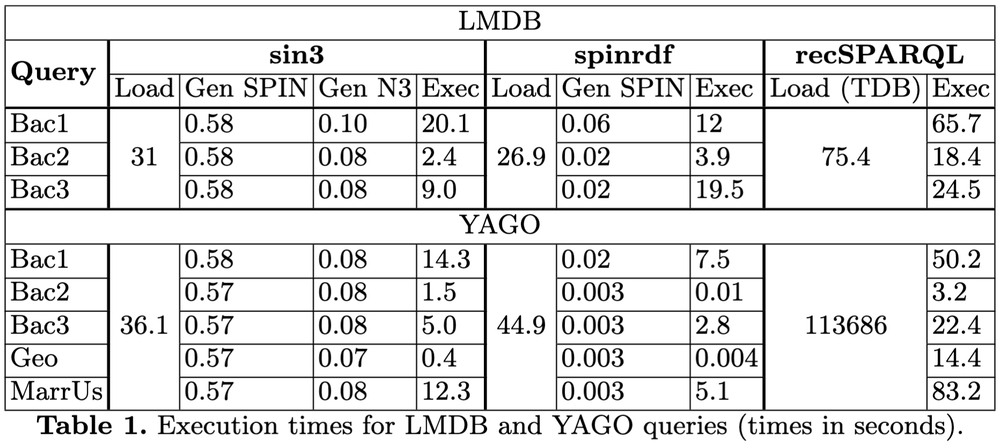
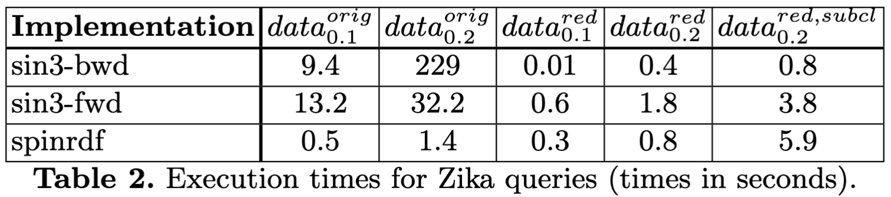

# Performance Experiments

## Setup

### Datasets and queries

__LMDB and YAGO__.  
We apply a similar setup as recSPARQL [1], which used the LMDB (Linked Movie Database), an RDF dataset about movies and actors [2] (6,148,121 triples); and YAGO (Yet Another Great Ontology), RDF data including people, locations, and movies [3] (3,000,006 triples). 

Movie-related recursive construct queries were formulated on both datasets:  
- _Bac1_. Searches for actors with a finite “Bacon number”, i.e., they co-starred in the same movie with Kevin Bacon or another actor with such a number.  
- _Bac2_. Searches for actors with a finite Bacon number whereby all collaborations were done in movies with the same director.  
- _Bac3_. Searches for actors connected to Kevin Bacon through movies where the director is also an actor (not necessarily in the same movie).

They further formulated the following queries on the YAGO dataset:
- _Geo_. Searches for places in which the city of Berlin is (transitively) located.
- _MarrUs_. Searches for people who are transitively related to someone through the isMarriedTo relation, who owns property within the United States. 
    Hence, these queries mostly calculate the transitive closure of a given relation.

__Zika screening__.  
We base ourselves on a prior healthcare use case on Zika screening [4]. 
Using construct queries, we implemented the CDC testing guidance for Zika, which determine whether a patient should be tested for Zika, 
based on a series of factors. We expand on this test case with randomly generated datasets, different versions of the used HL7 FHIR vocabulary [5], 
and reasoning over a biomedical ontology, i.e., SNOMED [6].

_Original FHIR vocabulary_.
We randomly generated 2 datasets of 1000 patients: in $`data^{orig}_{0.2}`$, patients had 0.2 chance of having a Zika indicator; in $`data^{orig}_{0.1}`$, patients had 0.2 chance of having a Zika indicator.
This led to respectively ca. 2.5% ($`data^{orig}_{0.2}`$), and ca. 0.5% of patients ($`data^{orig}_{0.1}`$) who should be tested for Zika. 
Patients have at most 2 conditions.
Code snippets [here](zika/snippets/orig/) illustrate how patients, conditions and observations are represented in the original HL7 FHIR vocabulary.

_Reduced FHIR vocabulary_. This is a reduced version of the FHIR vocabulary that relies less on deeply structured data. 
We similarly generated random datasets using this vocabulary, namely $`data^{red}_{0.2}`$ and $`data^{red}_{0.1}`$.
Code snippets [here](zika/snippets/red/) illustrate how patients, conditions and observations are represented in the reduced HL7 FHIR vocabulary.

| dataset | vocabulary | number of triples | chance of zika indicator
|---|---|---|---|
| $`data^{orig}_{0.1}`$ | original | 20,241 | 0.1 | 
| $`data^{orig}_{0.2}`$ | original | 36,358 | 0.2 | 
| $`data^{red}_{0.1}`$ | reduced | 9,203 | 0.1 | 
| $`data^{red}_{0.2}`$ | reduced | 16,346 | 0.2 |

### Systems

We used the EYE v10.24.10 reasoner [7], which can perform both forward and backward reasoning. 
Our prior demo paper [4] outlines the implementation of sin3, including the different execution steps and rulesets involved. 

We compare with two other systems that utilize construct queries for rule-based reasoning, namely spin-rdf [8] and recSPARQL [1]. 

### Hardware
The experiments were conducted on a MacBook Pro with an Apple M1 Pro processor, 32 GB of RAM, and a 1 TB SSD, running macOS Sonoma 14.6.1. 
Each experiment was executed 5 times and results were averaged.

## Results

### LMDB and YAGO

Both sin3 and spinrdf involve converting input SPARQL queries into SPIN code (Gen SPIN). 
Subsequently, sin3 converts the SPIN code into N3 rules (Gen N3). 
We observe that Gen SPIN takes much longer for sin3 than spinrdf, as the former requires starting a separate JVM for generating SPIN code. 
Sin3 and spinrdf load the dataset into memory (Load), whereas recSPARQL pre-creates a persistent Jena Triple DataBase (Load TDB). 

Sin3 is competitive regarding reasoning performance (Exec): 
for the LMDB dataset, on average, sin3 takes ca. 10.5s, spinrdf ca. 11.8s, and recSPARQL ca. 36.2s. 
For the Yago dataset, on average, sin3 takes ca. 6.7s , spinrdf ca. 3.1s, and recSPARQL ca. 34.7s. 
Hence, we note that spinrdf, which uses a query engine (Jena), performs much better for the Yago dataset.

A benefit of rule languages is that both forward- and backward reasoning strategies can be used. 
To illustrate this, we used the [Deep Taxonomy (DT)](https://eulersharp.sourceforge.net/2009/12dtb/), 
a construct query that implements the OWL2 RL cax-sco rule [9], 
and a custom query requesting all instances of class A2. 
Backward reasoning has an advantage here, as only a small part of the transitive closure has to be searched;
forward reasoning has to materialize the entire transitive closure. 
Indeed, after translating the OWL2 RL query to a backward-chaining N3 rule, eye takes avg. 34ms, 
while spinrdf does not return results after 1h (results not shown in table).

### Zika experiment

<!-- | Implementation | $`data^{orig}_{0.1}`$ | $`data^{orig}_{0.2}`$ | $`data^{red}_{0.1}`$ | $`data^{red}_{0.2}`$ | $`data^{red,subcl}_{0.2}`$ |
| --- | --- | --- | --- | --- | --- |
| sin3-bwd  | 9.4   | 229   | 0.01 | 0.4  | 0.8 |
| sin3-fwd  | 13.2  | 32.2  | 0.6  | 1.8  | 3.8 |
| spinrdf   | 0.5   | 1.4   | 0.3  | 0.8  | 5.9 | -->

Here, we focus on the impact of the type of rule reasoning (forward vs. backward) and implementation (rule engine vs. query engine). 
We refer to SiN3 using backward reasoning as sin3-bwd, forward reasoning as sin3-fwd, and use spinrdf as the exemplar query engine, as it performed best in the prior experiment. 
We further used the following FHIR vocabularies:

__Original FHIR vocabulary__. The original FHIR vocabulary is deeply nested, meaning any non-trivial query will require a lot of joins. 
We thus expect query engines (spinrdf ) to have an advantage as they tend to be optimized for joins. 

Indeed, we found the number of joins to be problematic for rule engines.
Reasoning over $`data^{orig}_{0.1}`$ using sin3-fwd reasoning takes ca. 13.2s, 
and 9.4s using sin3-bwd, 
whereas spinrdf only takes ca. 0.5s. 

For $`data^{orig}_{0.1}`$ , sin3-bwd has an advantage over the sin3-fwd variant, 
as only a small number of patients will be positive, and thus only a small part of the state space has to be searched. 
This advantage is completely lost for $`data^{orig}_{0.2}`$, where sin3-bwd takes ca. 229s, 
and sin3-fwd takes ca. 32s, and spinrdf only takes ca. 1.4s.

__Reduced FHIR vocabulary__. 
Here, we see the performance equalizing: for $`data^{red}_{0.2}`$, 
i.e., with the most rules firing, sin3-bwd takes ca. 0.4s, sin3-fwd takes ca. 1.8s, and spinrdf takes ca. 0.8s.
We thus observe that complex and deeply nested data structures, with non-trivial data size, are problematic for rule engines. 

__Reasoning with SNOMED and OWL2 RL__. Realistically, patients will often not be tagged with a high-level condition (e.g., muscle pain), but rather with a more specific sub-condition (e.g., abdominal muscle pain). 

The CDC guidelines, i.e., on which this use case is based, refer to SNOMED [10]. 
We extracted its subclass hierarchy (31.5 Mb) and included it in a third dataset $`data^{orig,subcl}_{0.2}`$,
which also uses reduced FHIR but with more specific condition codes. 
We include a construct query representing the OWL2 RL cax-sco OWL2 RL rule [11].

We expect a backward-chaining rule engine to perform better here, as it will not have to materialize the entire subclass closure. 
Indeed, sin3-bwd takes around 0.8s, sin3-fwd around 3.8s, and spinrdf around 5.9s. 

# References
[1] Reutter, J., Soto, A., Vrgoč, D.: Recursion in SPARQL. Semantic Web 12(5), 711–740 (2021)  
[2] Hassanzadeh, O., Consens, M.P.: Linked movie data base. In: LDOW (2009)  
[3] Pellissier Tanon, T., Weikum, G., Suchanek, F.: Yago 4: A reason-able knowledge base. In: The Semantic Web: 17th International Conference, ESWC 2020, Heraklion, Crete, Greece, May 31–June 4, 2020, Proceedings 17. pp. 583–596. Springer (2020)  
[4] D. Arndt, W. Van Woensel, D. Tomaszuk, Sin3: Scalable inferencing with sparql construct queries, in: ISWC (Posters/Demos/Industry), 2023  
[5] HL7 International, HL7 Fast Health Interop Resources (FHIR), 2025. URL: https://www.hl7.org/index.cfm  
[6] U.S. National Library of Medicine: SNOMED CT, https://www.nlm.nih.gov/healthit/snomedct/index.html  
[7] Verborgh, R., De Roo, J.: Drawing conclusions from linked data on the web: The EYE reasoner. IEEE Software 32(5), 23–27 (May 2015)
[8] Andy Seaborne, M.J.: Spinrdf (2019), https://github.com/spinrdf/spinrdf
[9] Calvanese, D., Carroll, J., De Giacomo, G., Hendler, J., Herman, I., Parsia, B., Patel-Schneider, P.F., Ruttenberg, A., Sattler, U., Schneider, M.: OWL2 web ontology language profiles (second edition): OWL2 RL. W3c recommendation, W3C (Dec 2012), https://www.w3.org/TR/2012/REC-owl2-profiles-20121211/